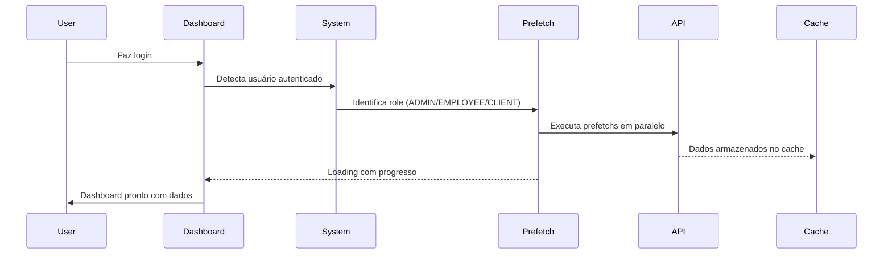

# ✅ PREFETCH AUTOMÁTICO IMPLEMENTADO

## 🎯 **O QUE FOI IMPLEMENTADO**

### Sistema de Prefetch Automático Baseado em Role

- ✅ **Execução automática** após login
- ✅ **Prefetchs baseados no role** do usuário
- ✅ **Loading com progresso** visual
- ✅ **Timeout de 8s** por prefetch
- ✅ **Execução em paralelo** para performance
- ✅ **Resistente a falhas** - continua mesmo se um prefetch falhar

## 🔑 **PREFETCHS POR ROLE**

### **SUPER_ADMIN / ADMIN**

```javascript
Prefetchs executados:
✅ prefetchDashboardStats      // Estatísticas completas
✅ prefetchTodayAppointments   // Agendamentos de hoje
✅ prefetchEmployees           // Lista de funcionários
✅ prefetchAllServices         // Todos os serviços
✅ prefetchAvailableServices   // Serviços disponíveis
✅ prefetchCurrentProfile      // Perfil atual
✅ prefetchAppSettings         // Configurações
```

### **EMPLOYEE (Funcionários)**

```javascript
Prefetchs executados:
✅ prefetchMyAppointments      // Meus agendamentos
✅ prefetchTodayAppointments   // Agendamentos de hoje
✅ prefetchAvailableServices   // Serviços disponíveis
✅ prefetchCurrentProfile      // Perfil atual
✅ prefetchAppSettings         // Configurações
```

### **CLIENT (Clientes)**

```javascript
Prefetchs executados:
✅ prefetchMyAppointments      // Meus agendamentos
✅ prefetchAvailableServices   // Serviços disponíveis
✅ prefetchCurrentProfile      // Perfil atual
✅ prefetchAppSettings         // Configurações
```

## 🎮 **FLUXO DE FUNCIONAMENTO**

### 1. Login → Prefetch Automático



### 2. Logs que você verá:

```
🚀 [Dashboard] Iniciando prefetchs automáticos...
📋 [Dashboard] Executando prefetchs para role: SUPER_ADMIN
🔑 [Dashboard] Prefetchs ADMIN: prefetchDashboardStats, prefetchTodayAppointments, prefetchEmployees, prefetchAllServices, prefetchAvailableServices
⭐ [Dashboard] Prefetchs ESSENCIAIS: prefetchCurrentProfile, prefetchAppSettings
✅ [Dashboard] Prefetchs concluídos em 1247ms: 7 sucessos, 0 falhas
✅ [Dashboard] Dashboard inicializado com prefetchs
```

## 🎯 **BENEFÍCIOS IMEDIATOS**

### ⚡ **Performance**

- **Navegação instantânea**: Dados já estão no cache
- **Menos loading states**: UX mais fluida
- **Execução paralela**: Todos os prefetchs simultâneos

### 🎨 **Experiência do Usuário**

- **Loading inteligente**: Mostra progresso dos prefetchs
- **Feedback visual**: "Preparando dashboard..."
- **Baseado em permissões**: Cada role vê dados relevantes

### 🛡️ **Robustez**

- **Timeout de 8s**: Não trava o dashboard
- **Resistant a falhas**: Continua se um prefetch falhar
- **Progress tracking**: Usuário vê o que está acontecendo

## 🔧 **COMO TESTAR**

### 1. Fazer Login

- Acessar `http://localhost:3001/dashboard`
- Fazer login com qualquer usuário
- **Observar**: Loading com "Preparando dashboard..."

### 2. Verificar Logs no Console

```javascript
// Você deve ver logs como:
📋 [Dashboard] Executando prefetchs para role: SUPER_ADMIN
✅ [Dashboard] Prefetchs concluídos em 1247ms: 7 sucessos, 0 falhas
```

### 3. Testar Navegação

- Após o loading, navegar entre páginas
- **Resultado**: Navegação instantânea com dados já carregados

### 4. Testar Diferentes Roles

- Login com ADMIN: 7 prefetchs
- Login com EMPLOYEE: 5 prefetchs
- Login com CLIENT: 4 prefetchs

## 📊 **MÉTRICAS DE PERFORMANCE**

### Antes (Sem Prefetch)

```
Dashboard → Loading → Appointments → Loading → Services → Loading
   200ms      500ms        300ms      400ms       250ms

Total: ~1.65s para navegar 3 páginas
```

### Depois (Com Prefetch)

```
Login → Prefetch (1-2s) → Dashboard (0ms) → Appointments (0ms) → Services (0ms)

Total: Navegação instantânea após prefetch inicial
```

## 🚀 **PRÓXIMOS PASSOS**

1. **Integração com SSE**: Quando dados mudarem no backend, prefetchs automáticos
2. **Cache Inteligente**: Invalidação baseada em tempo/mudanças
3. **Métricas**: Tracking de performance dos prefetchs
4. **Otimizações**: Prefetchs condicionais baseados em uso

---

## 🎉 **RESULTADO**

**Agora o sistema automaticamente precarrega dados após o login, baseado no role do usuário, resultando em navegação instantânea no dashboard!**

### Para testar:

1. Fazer login em `http://localhost:3001/dashboard`
2. Observar loading "Preparando dashboard..."
3. Navegar entre páginas → **Instantâneo!** ⚡
